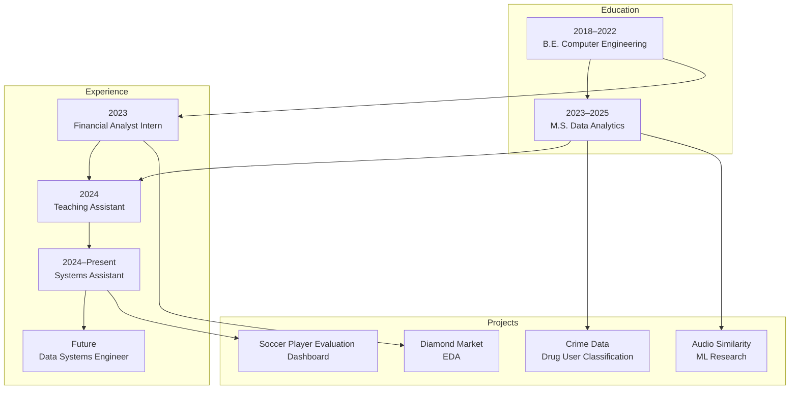

# Karthik Sivaraman Iyer

**DATA ANALYST**  
Arlington, VA  
📧 karthikiyer365@gmail.com · 📞 +1 (202) 713‑1699  
🔗 [linkedin.com/in/kiyer8](https://linkedin.com/in/kiyer8)

---

## 🧭 Professional Snapshot
```text
Data Analyst with strong foundations in statistical modeling, data engineering, and applied machine learning.
Experienced in translating messy, large‑scale data into actionable insights across education, finance, and analytics‑driven research.
```

---

## 🎓 Education

### George Washington University — Washington, DC, USA  
**Master of Science in Data Analytics** · *GPA: 3.68*  
_Aug 2023 — May 2025_

**Relevant Coursework**  
Probabilistic Analysis · Quantitative Analysis · Data Wrangling · Data Manipulation · Data Pipelines · NLP

---

### University of Mumbai — Mumbai, MH, India  
**Bachelor of Engineering in Computer Engineering** · *GPA: 3.6*  
_Aug 2018 — May 2022_

**Relevant Coursework**  
Image Processing · Relational Database Management · Website Development · Data Structures & Algorithms

---

## 🧠 Skills

```text
skills/
├── programming/
│   ├── python
│   ├── sql
│   ├── r
│   ├── c
│   ├── html
│   ├── css
│   └── javascript
│
├── data-management/
│   ├── postgresql
│   ├── mysql
│   ├── mongodb
│   └── spark
│
├── data-visualization/
│   ├── tableau
│   ├── power-bi
│   ├── excel
│   ├── sas
│   ├── minitab
│   ├── matplotlib
│   ├── seaborn
│   ├── plotly-js
│   └── dash
│
├── cloud-platforms/
│   ├── aws/
│   │   ├── ec2
│   │   ├── iam
│   │   └── s3
│   └── gcp/
│       ├── cloud-sql
│       ├── databricks
│       ├── looker-studio
│       └── docker
│
└── certifications/
    ├── google-analytics-ga4
    └── azure-ml-pipelines
```

---


## 💼 Experience

### Student Assistant — Systems Administration  
**George Washington University** · Washington, DC  
_Aug 2024 — Present_

- Resolved **30+ technical tickets** across macOS, Windows, and Linux for 10+ applications, achieving a **97% resolution rate**
- Supported inventory audits and demand forecasting using **BMC Helix**, improving operational success to **89%**
- Maintained transparent communication with students and faculty, driving **90% customer satisfaction**

---

### Teaching Assistant — Probability & Decision Making with Data  
**George Washington University** · Washington, DC  
_Sep 2024 — Dec 2024_

- Built an **auto‑grading system** using Python, NLP, BERT, and Excel, saving **10+ faculty hours/week**
- Collaborated with 3 faculty members to refine grading logic, improving consistency by **25%**
- Centralized evaluation workflows for **400+ assignments**, reducing turnaround time by **60%**
- Led weekly 3‑hour student sessions simplifying probabilistic and statistical concepts

---

### Financial Analyst Intern  
**DPSY & Associates** · Mumbai, India  
_Apr 2023 — Jun 2023_

- Analyzed the **$85B+ diamond market**, identifying seasonal pricing shifts (28% → 37%) to inform inventory strategy
- Automated reconciliation workflows with **Excel macros, VLOOKUPs, and Pivot Tables**, reducing effort by **25%**
- Contributed to **24‑month LMS audit reports**, identifying **20 compliance discrepancies**
- Built **SQL‑based ETL pipelines** (SSAS) ensuring audit integrity across **5M+ accounts**

---

## 🧪 Technical Projects

### Audio Similarity‑Based Artist Recommendation *(Research)*  
_Mar 2024 — Jun 2024_

- Scraped and transformed NoSQL music metadata using **BeautifulSoup + Regex**, generating **20K+ artists/week**
- Extracted MFCC audio features from WAV files and applied **PCA on 20 dimensions**
- Implemented SVC classification using **GTZAN**, achieving **74% accuracy** and **97% AUC**

---

### Drug User Classification — Crime Data Analysis  
_Oct 2023 — Dec 2023_

- Conducted EDA and PCA to isolate **6 socio‑economic predictors** for classification models
- Built **Random Forest & Logistic Regression** models; Logistic Regression achieved **70% recall**
- Applied categorical encoding, log transforms, and interaction terms, improving recall by **10%**

---

### Soccer Player Data Dashboard  
_Jan 2023 — May 2023_

- Analyzed **100K+ players** across 5+ seasons and defined **4 performance KPIs**
- Deployed an interactive **Dash + Plotly** dashboard for time‑series and comparative analysis
- Produced a comprehensive report with **20+ visualizations** and actionable insights

---

## 🗺️ Career Path



---
mermaid
flowchart LR
    A[2018
University of Mumbai
B.E. Computer Engineering]
    B[2022
Graduation]
    C[2023
Financial Analyst Intern
DPSY & Associates]
    D[2023
GWU MS Data Analytics]
    E[2024
Research & ML Projects]
    F[2024
Teaching Assistant]
    G[2024‑Present
Systems Administration]
    H[2025
MS Graduation]

    A --> B --> C --> D --> E --> F --> G --> H
```

---

## 🔚 End of File
```yaml
languages:
  - English
  - French
  - Hindi
  - Tamil
  - Marathi

hobbies:
  - Football
  - Data exploration
  - Leadership

leadership:
  - IEEE Executive Member – Region 10 (Asia Pacific) | 2018–2023
  - SIES Model United Nations
```

