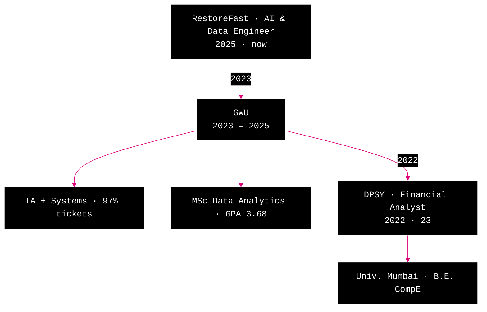

# resume.md Graphical Formatting Implementation Plan

> **For agentic workers:** REQUIRED SUB-SKILL: Use superpowers:subagent-driven-development (recommended) or superpowers:executing-plans to implement this plan task-by-task. Steps use checkbox (`- [ ]`) syntax for tracking.

**Goal:** Rewrite the Skills and Experience sections of `content/resume.md` into a structural/graphical form (ASCII proficiency grid + vertical mermaid flowchart), bump code-block font size, and reconcile the résumé identity to "AI & Data Engineer."

**Architecture:** `content/resume.md` is rendered by `components/EditorWorkspace.tsx` (ReactMarkdown + remark-gfm) with a code-view toggle. No raw HTML is allowed, so all graphics use markdown-native constructs: fenced code blocks (ASCII art) and mermaid blocks. One styling change to the editor's `pre/code` font size supports the larger skills grid.

**Tech Stack:** Next.js, React, ReactMarkdown, remark-gfm, mermaid (via `components/MermaidDiagram.tsx`), Tailwind.

**Verification note:** This is content/presentation work with no unit-test surface. Each task verifies by rendering in the dev server (`npm run dev` → http://localhost:3000), opening the résumé file, checking both **preview** and **code-view** modes, and confirming no console errors. Proficiency-bar levels are Karthik's to fine-tune; the values below are sensible defaults, not placeholders.

**Source spec:** `docs/superpowers/specs/2026-05-30-resume-md-graphical-formatting-design.md`

---

## File Structure

| File | Responsibility | Change |
|---|---|---|
| `components/EditorWorkspace.tsx` | Markdown rendering, code-block styling | Bump fenced `pre/code` font `text-xs` → `text-sm` |
| `content/resume.md` | Résumé content | Replace Skills section; replace Career Path/Experience structure with mermaid flowchart; reconcile identity header |

---

## Task 1: Bump code-block font size

**Files:**
- Modify: `components/EditorWorkspace.tsx` (the fenced-code `pre/code` renderer, currently around line 198-206)

- [ ] **Step 1: Locate the fenced-code branch**

In `components/EditorWorkspace.tsx`, find the `code` component's language branch:

```tsx
if (lang) {
  return (
    <pre className="bg-[#1a1a1a] rounded-lg p-4 overflow-auto my-3 border border-[#2a2a2a]">
      <code className="text-xs text-[#d4d4d4] font-mono">
        {codeStr}
      </code>
    </pre>
  );
}
```

- [ ] **Step 2: Change `text-xs` → `text-sm`**

Replace that `code` line with:

```tsx
      <code className="text-sm text-[#d4d4d4] font-mono">
```

(Leave the inline-code branch below it — `bg-[#2a2a2a] text-[#ce9178] ... text-xs` — UNCHANGED. Only the block `pre > code` changes.)

- [ ] **Step 3: Render-verify**

Run: `npm run dev`
Open http://localhost:3000 → "Open portfolio" → open `resume.md` → preview mode.
Expected: existing fenced blocks (Professional Snapshot, the skills tree) render at a noticeably larger size; no layout breakage. Toggle to code-view: line text is unaffected (only fenced blocks use this renderer).

- [ ] **Step 4: Commit**

```bash
git add components/EditorWorkspace.tsx
git commit -m "ui:resume bump fenced code-block font text-xs to text-sm"
```

---

## Task 2: Replace Skills section with 3-column ASCII proficiency grid

**Files:**
- Modify: `content/resume.md` — the `## 🧠 Skills` section (the fenced `/skills` tree block)

- [ ] **Step 1: Replace the skills code block**

In `content/resume.md`, find the `## 🧠 Skills` heading and its following ```` ```text ```` … ```` ``` ```` tree block. Replace the entire fenced block (from the opening ```` ```text ```` through its closing ```` ``` ````) with this exact block:

````text
```text
languages          │   data / etl            │   ml / ai
───────────        │   ────────────          │   ─────────
python   ▰▰▰▰▰▰▰▱   │   spark       ▰▰▰▰▰▱▱▱   │   llms·rag   ▰▰▰▰▰▰▱▱
sql      ▰▰▰▰▰▰▱▱   │   databricks  ▰▰▰▰▰▱▱▱   │   ml models  ▰▰▰▰▰▰▰▱
r · c    ▰▰▰▰▱▱▱▱   │   mongo·sql   ▰▰▰▰▰▰▱▱   │   pca·bert   ▰▰▰▰▰▱▱▱

cloud              │   bi / viz              │   tools
───────────        │   ────────────          │   ─────────
aws·gcp  ▰▰▰▰▰▱▱▱   │   tableau     ▰▰▰▰▰▰▱▱   │   git·ci/cd  ▰▰▰▰▰▱▱▱
azure    ▰▰▰▰▱▱▱▱   │   power bi    ▰▰▰▰▰▱▱▱   │   next·trpc  ▰▰▰▰▰▱▱▱
```
````

- [ ] **Step 2: Render-verify preview**

With dev server running, reload the résumé in preview mode.
Expected: three columns separated by `│`, header rules under each label, bars aligned. Columns stay aligned because the block is monospace.

- [ ] **Step 3: Render-verify code-view + alignment**

Toggle to code-view.
Expected: the grid remains legible and the `│` dividers line up vertically. If any column is misaligned, adjust spacing in the block so the `│` characters align in a monospace font.

- [ ] **Step 4: Commit**

```bash
git add content/resume.md
git commit -m "ui:resume replace skills tree with 3-column proficiency grid"
```

---

## Task 3: Replace Career Path with vertical experience flowchart (forked GWU)

**Files:**
- Modify: `content/resume.md` — the `## 🗺️ Career Path` section (the existing ```` ```mermaid ```` `flowchart LR` block)

**Note:** This implements the locked structure only (spine + forked GWU + year edges). Per the spec, the per-node branch/info detail is a deferred follow-up — do NOT add highlight bullets to the nodes in this task.

- [ ] **Step 1: Replace the Career Path mermaid block**

Find the `## 🗺️ Career Path` heading and its following ```` ```mermaid ```` … ```` ``` ```` block. Replace the entire fenced mermaid block with this exact block:

````text

````

- [ ] **Step 2: Render-verify the flowchart**

With dev server running, reload the résumé in preview mode.
Expected: a top-to-bottom flowchart. `RestoreFast` at top → `GWU` (which forks to two children `TA + Systems` and `MSc`, showing concurrency) → `DPSY` → `Univ. Mumbai`. Year labels (`2023`, `2022`) sit on the connecting edges. Pink (`#dd0077`) edge lines.

- [ ] **Step 3: Check console for mermaid errors**

In the browser devtools console, confirm there are no mermaid parse errors. If the `\n` line breaks don't render as line breaks, replace `\n` with `<br/>` inside each node label (mermaid supports `<br/>` when `htmlLabels` are on, which is mermaid's default).

- [ ] **Step 4: Commit**

```bash
git add content/resume.md
git commit -m "ui:resume replace career path with vertical experience flowchart"
```

---

## Task 4: Reconcile identity to "AI & Data Engineer"

**Files:**
- Modify: `content/resume.md` — the header subtitle and Professional Snapshot

- [ ] **Step 1: Update the header role label**

Near the top of `content/resume.md`, find:

```markdown
**DATA ANALYST**
```

Replace with:

```markdown
**AI & DATA ENGINEER**
```

- [ ] **Step 2: Update the Professional Snapshot**

Find the `## 🧭 Professional Snapshot` fenced block:

```text
Data Analyst with strong foundations in statistical modeling, data engineering, and applied machine learning.
Experienced in translating messy, large‑scale data into actionable insights across education, finance, and analytics‑driven research.
```

Replace the block's text with:

```text
AI & Data Engineer with 2+ years building agentic AI systems, ETL pipelines, and decision dashboards.
I turn messy, large‑scale data into production systems — RAG/agent workflows, multi‑channel LLM comms, and analytics that move KPIs.
```

- [ ] **Step 3: Render-verify**

Reload the résumé in preview mode.
Expected: header reads "AI & DATA ENGINEER"; snapshot reflects the AI/engineering narrative consistent with the chatbot's KNOWLEDGE_MAP.

- [ ] **Step 4: Commit**

```bash
git add content/resume.md
git commit -m "content:resume reconcile identity to AI & Data Engineer"
```

---

## Out of scope (deferred follow-ups)

- **Branch/info segmentation** of the experience flowchart (which highlight bullets attach to each node and how) — explicitly deferred in the spec.
- **Full content reconciliation** of the Projects and Experience-bullet sections to the AI & Data Engineer narrative (which projects to feature, rewriting bullets) — this plan reconciles the *identity header/snapshot* and the *experience flowchart* only.
- **`.ipynb` graphical enhancement** — separate task; user will brief the approach.

## Self-Review

- **Spec coverage:** Skills (§4) → Task 2 ✓. Experience flowchart (§5) → Task 3 ✓. Font bump (§4) → Task 1 ✓. Identity (§7) → Task 4 ✓. Deferred items (§5, §9) → listed as out of scope ✓.
- **Placeholders:** none — every block is literal content. Proficiency levels are flagged as Karthik's to adjust, with concrete defaults provided (not TBD).
- **Consistency:** node IDs `RF/GWU/TA/MSc/DPSY/MU` are defined and referenced consistently in Task 3; the `lineColor:#dd0077` matches the pink theme referenced in the spec.
